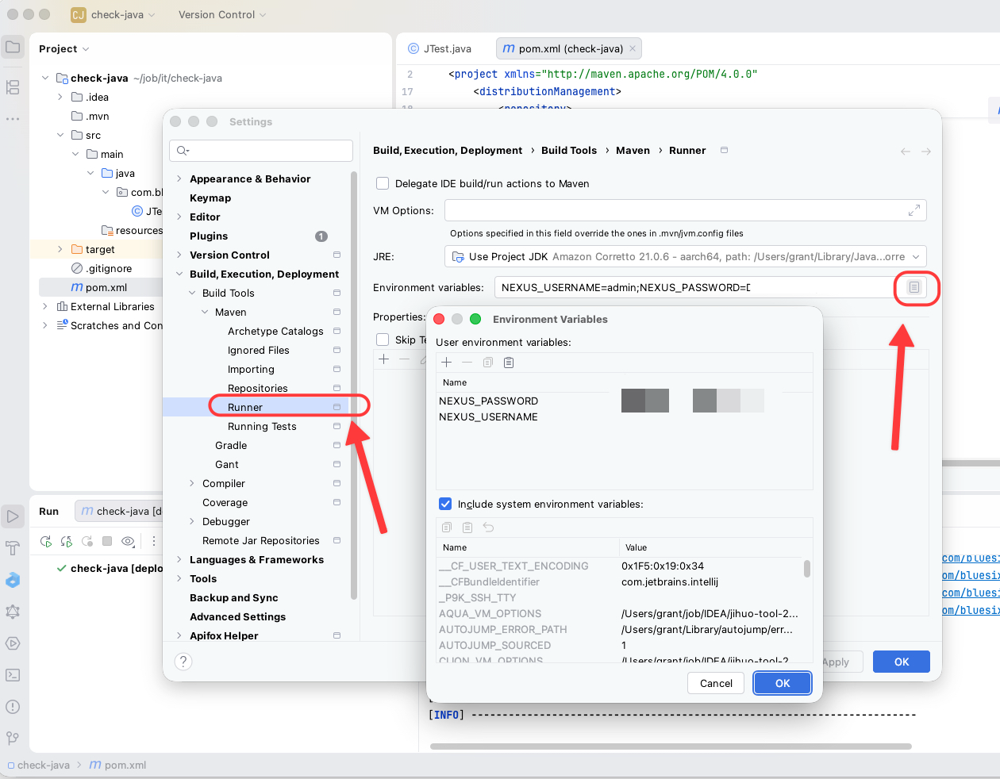

## maven setting

## package
```shell
com.bluesix.
```

## user.sh
> Contact the person in charge for account and password.

```shell
export NEXUS_USERNAME='你的Nexus用户名'
export NEXUS_PASSWORD='你的Nexus密码'
```

## settings.xml
> Linux/macOS：~/.m2/settings.xml
> 
> Windows：%USERPROFILE%\.m2\settings.xml
```xml
<?xml version="1.0" encoding="UTF-8"?>

<settings xmlns="http://maven.apache.org/SETTINGS/1.2.0"
          xmlns:xsi="http://www.w3.org/2001/XMLSchema-instance"
          xsi:schemaLocation="
            http://maven.apache.org/SETTINGS/1.2.0
            https://maven.apache.org/xsd/settings-1.2.0.xsd">

    <servers>
        <server>
            <id>bluesix-maven</id>
            <username>${env.NEXUS_USERNAME}</username>
            <password>${env.NEXUS_PASSWORD}</password>
        </server>

        <!-- 发布正式版本时使用 -->
        <server>
            <id>bluesix-releases</id>
            <username>${env.NEXUS_USERNAME}</username>
            <password>${env.NEXUS_PASSWORD}</password>
        </server>

        <!-- 发布快照版本时使用 -->
        <server>
            <id>bluesix-snapshots</id>
            <username>${env.NEXUS_USERNAME}</username>
            <password>${env.NEXUS_PASSWORD}</password>
        </server>
    </servers>

    <mirrors>
        <mirror>
            <id>bluesix-maven</id>
            <name>Bluesix Nexus Maven Repository</name>
            <url>https://mvn.bluesix.xyz/repository/maven-public/</url>
            <mirrorOf>*</mirrorOf>
        </mirror>
    </mirrors>

    <profiles>
        <profile>
            <id>bluesix</id>

            <repositories>
                <repository>
                    <id>bluesix-public</id>
                    <url>https://mvn.bluesix.xyz/repository/maven-public/</url>

                    <releases>
                        <enabled>true</enabled>
                        <updatePolicy>daily</updatePolicy>
                    </releases>

                    <snapshots>
                        <enabled>true</enabled>
                        <updatePolicy>always</updatePolicy>
                    </snapshots>
                </repository>
            </repositories>

            <pluginRepositories>
                <pluginRepository>
                    <id>bluesix-plugins</id>
                    <url>https://mvn.bluesix.xyz/repository/maven-public/</url>

                    <releases>
                        <enabled>true</enabled>
                    </releases>

                    <snapshots>
                        <enabled>true</enabled>
                    </snapshots>
                </pluginRepository>
            </pluginRepositories>
        </profile>
    </profiles>

    <activeProfiles>
        <activeProfile>bluesix</activeProfile>
    </activeProfiles>
</settings>
```


## java project

```pom
<distributionManagement>
    <repository>
        <id>bluesix-releases</id>
        <name>Bluesix Releases</name>
        <url>
            https://mvn.bluesix.xyz/repository/maven-releases/
        </url>
    </repository>

    <snapshotRepository>
        <id>bluesix-snapshots</id>
        <name>Bluesix Snapshots</name>
        <url>
            https://mvn.bluesix.xyz/repository/maven-snapshots/
        </url>
    </snapshotRepository>
</distributionManagement>
```

